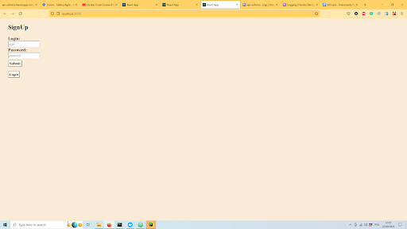
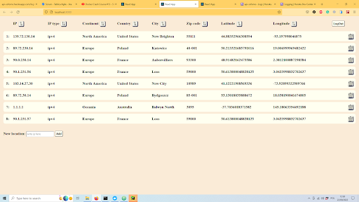

Client:

Client allows you to quickly and pleasantly view and edit data using a graphical interface. Developed in the React environment. The source code can be found here:

https://github.com/GregorD1A1/Locations-client

To launch the client application, download the container by typing the command in the console:

***docker pull gregord1/locations_client***

then run with the command:

***docker run -p 3000:3000 gregord1/locations_client***

By typing "localhost:3000" in the browser window, we will find a running application. First we will be shown a login window:

If we do not yet have a user account created, use the "SignUp" button to switch to the registration window:

Where to create a new user by entering a login and password. Then use the "Login" button to switch back to the login window, where we log in using the login and password entered during registration.
The main window of the program will appear, where we can see all the location data, contained in the database.

To add a new location to the list, enter its IP address in the "New location:" window at the bottom and add with the "Add" button. Note: as the number of queries in the free version of ipstack is limited, after intensive work and testing there are about 20 queries left for September, so use this function sparingly.
We can delete records by clicking on the trash stamp to the right of the record. We can also sort the records according to different parameters, using the checkmark on the top bar of the page, next to the parameter.
When the session is over, you can log out using the "LogOut" button.
